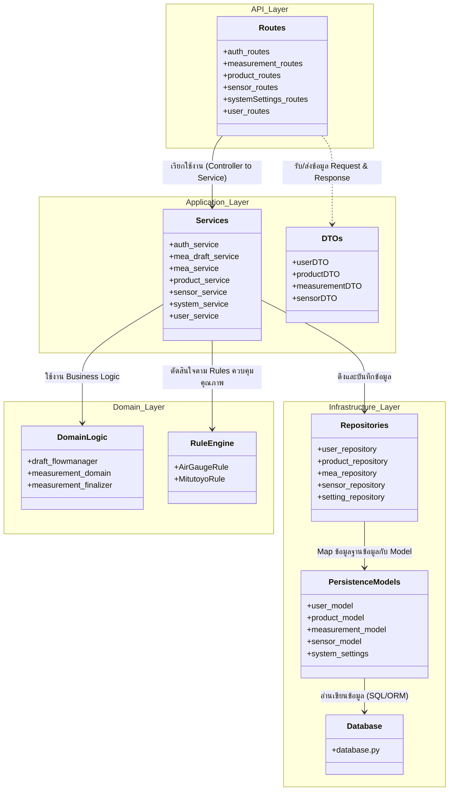
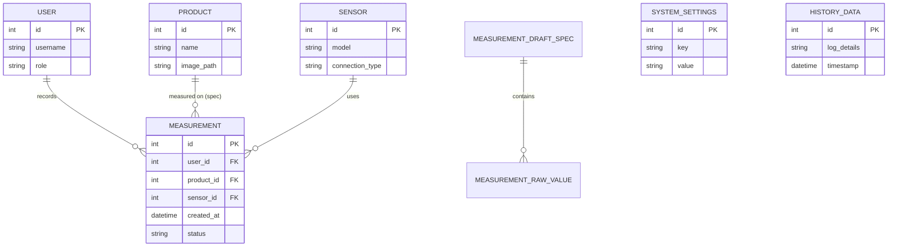

# Backend Architecture and Data Flows

นี่คือ Diagram โครงสร้างระบบ (System Architecture) และความสัมพันธ์ของข้อมูล (Entity Relationship) ของโปรเจกต์ Backend นี้ครับ 

## วิธีการนำไปใช้ใน Draw.io
1. ให้เปิดเว็บ [draw.io](https://app.diagrams.net/)
2. สร้าง Diagram ใหม่
3. ไปที่เมนู **Arrange -> Insert -> Advanced -> Mermaid...** (หรือ **คลิกเครื่องหมาย + บน Toolbar -> Advanced -> Mermaid...**)
4. Copy โค้ดของ Mermaid ด้านล่างไปวาง แล้วกด Insert จะได้รูป Diagram ทันทีครับสามารถปรับแก้ต่อได้เลย

---

### 1. System Architecture Diagram (Layered Architecture - DDD)
โค้ดสำหรับนำไปวางใน draw.io เพื่อแสดงโครงสร้างชั้น (Layer) ของโค้ดที่มีการแบ่งเป็น Api, Application, Domain, Infrastructure

---

### 2. Entity Relationship Diagram (ER Diagram)
Diagram แสดงความสัมพันธ์ของ Entity / Database Table ในระบบ

---

## สรุปโครงสร้าง Backend (Domain-Driven Design Pattern)
ระบบนี้ถูกออกแบบตามแนวคิด **Clean Architecture / Domain-Driven Design (DDD)** โดยแบ่งออกเป็น:
1. **API (`src/api`)**: รับผิดชอบเรื่องการรับ HTTP Request (Routes) เเละจัดการการสื่อสารจากภายนอก
2. **Application (`src/application`)**: มี `services` ที่เป็น Use Cases หลักของระบบ เเละ `dtos` (Data Transfer Objects) ไว้ลดทอนรูปทรงของข้อมูลก่อนส่งออก
3. **Domain (`src/domain` และ `src/ruleEngine`)**: เก็บ Core Business Logic เช่นการคำนวณ (Measurement Finalizer), หรือ Rule Engine สำหรับเครื่องมือวัดต่างๆ อย่าง AirGauge และ Mitutoyo
4. **Infrastructure (`src/infrastructure`)**: จัดการเรื่อง Database, Repository Pattern, เเละ Models ที่ต่อกับ ORM
